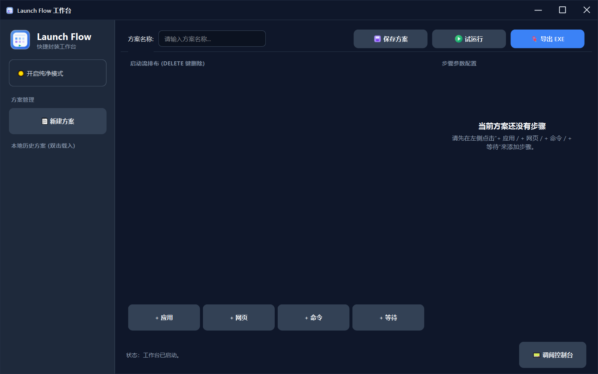

# LaunchFlow

> A visual launch workflow builder for Windows.

LaunchFlow 是一个面向 Windows 的可视化启动流程编排工具。  
你可以通过图形界面自由组合“应用、网页、命令、等待”等步骤，并进行试运行、保存方案以及导出独立启动包。

## English Summary

LaunchFlow is a Windows desktop app for visually composing startup workflows. It can launch local apps and scripts, open URLs, wait between steps, save plans as JSON, and export a plan as a standalone launcher EXE for small-scale distribution.

---

## 项目简介

LaunchFlow 旨在解决这样一类场景：

- 每次开机后都要手动打开多款固定软件
- 不同工作流需要不同的启动顺序
- 希望把常用启动方案保存下来并反复复用
- 希望为其他用户生成一个无需配置的独立启动程序

相较于传统的批处理脚本或手写命令，LaunchFlow 更强调：

- 可视化
- 低门槛
- 可维护
- 可复用
- 可导出

---

## 核心功能

- 可视化编辑启动方案
- 支持以下步骤类型：
  - 应用启动
  - 网页打开
  - 命令执行
  - 等待步骤
- 支持本地保存与加载方案
- 支持试运行当前方案
- 支持导出单文件 EXE，并自动携带可复制的本地应用启动文件
- 支持离线激活（Beta 测试版）

---

## 界面预览



---

## 适用场景

LaunchFlow 适用于：

- 程序员 / 开发者工作环境快速初始化
- 设计、办公、学习等多应用组合启动
- 固定工作流的一键执行
- 小范围工具分发与个性化启动方案封装

---

## 快速开始

### 方式一：直接使用发布版

下载发布的 `LaunchFlow.exe` 后直接运行即可。

当前测试版本采用离线激活方式：

1. 启动程序
2. 在激活页复制申请码
3. 将申请码发送给作者
4. 收到 `.lic` 授权文件后导入
5. 激活成功后进入工作台

详细说明见：

- [Beta Testing Guide](docs/beta-testing.md)

---

### 方式二：从源码运行

```bash
python editor/main.py
```

---

## 打包发布版

```bash
python tools/build_editor_release.py
```

打包完成后，可执行文件通常位于：

```text
dist/VisualLauncher.exe
```

> 后续如果你将代码中的 `APP_NAME` 与输出名称同步更新为 `LaunchFlow`，则输出文件名也可以一起调整。

### 导出用户启动包

工作台中的 **导出 EXE** 会将当前方案封装为一个独立启动包。

- 开发版优先使用当前 Python 环境中的 PyInstaller。
- 发布版内导出依赖目标机器存在可用的 PyInstaller 构建器；程序会尝试使用系统 `PATH` 中的 `pyinstaller`、`python -m PyInstaller` 或 `py -m PyInstaller`。
- 本地应用步骤中的 `.exe`、`.bat`、`.cmd`、`.com`、`.ps1` 文件会自动随包携带，并在启动包运行时优先从包内启动。
- `.lnk` 快捷方式不建议作为随包资产分发，因为它通常指向当前机器上的绝对路径。
- 如果被携带的应用依赖外部 DLL、配置文件或数据目录，目标电脑仍需具备对应环境。
- 导出只携带启动文件本身，不会自动扫描或复制目标程序的完整安装目录。

Export behavior in short: `.exe`, `.bat`, `.cmd`, `.com`, and `.ps1` app steps are bundled as launcher assets; `.lnk` shortcuts and external dependencies are not bundled automatically.

---

## 项目结构

```text
editor/          图形界面与工作台逻辑
editor/services/ 方案读写与路径管理服务

licensing/       离线激活与授权校验相关模块

runtime/         运行时执行器与调试入口
shared/          通用模型、校验器、工具函数、项目信息

tools/           打包工具、授权生成器、密钥生成脚本
docs/            项目文档与截图资源
data/            本地模板、设置与运行数据
```

---

## 文档导航

- [Beta Testing Guide](docs/beta-testing.md)
- [Architecture Overview](docs/architecture.md)

---

## 当前状态

当前项目处于 **Beta** 阶段，主要功能已经可用，后续将继续完善：

- 交互细节优化
- 文档补全
- 导出体验优化
- 主题与界面风格统一
- 更完整的异常处理与日志呈现

---

## 技术栈

- Python
- PySide6
- PyInstaller
- cryptography

## 开发与验证命令

```bash
python tools/check_ui_spinbox_contract.py
python tools/check_editor_gui_smoke.py
python tools/validate_export_smoke.py
python tools/validate_release_smoke.py
```

说明：

- `check_editor_gui_smoke.py` 会创建临时项目根并用 Qt offscreen 模式实例化主窗口，不依赖真实 license。
- `validate_export_smoke.py` 会真实构建并运行一个最小导出启动器。
- `validate_release_smoke.py` 会构建 `dist/LaunchFlow.exe`，检查发布目录中没有私钥或真实 `.lic`，并短暂启动发布版确认能进入启动流程。
- 人工验证请参考 [GUI Smoke Checklist](docs/gui-smoke-checklist.md)。

---

## 内测申请

当前版本仍处于小范围测试阶段。

如果你希望参与测试，请发送邮件至：

**wangheran55@gmail.com**

邮件标题建议：

```text
[LaunchFlow Beta] 申请内测
```

建议在邮件中附带以下信息：

- 你的系统版本（Windows 10 / 11）
- 你的典型使用场景
- 你希望重点体验的功能
- 是否愿意反馈 bug、截图或录屏

---

## 开源说明

本项目当前仍在持续整理与完善中。  
在正式公开仓库前，部分信息与文档可能仍会调整。

请注意：

- **私钥文件不会开源**
- 已签发给测试用户的授权文件不会公开
- 发布版用户无需接触授权生成逻辑
- `private/private_key.pem` 永不分发
- `generated_licenses/` 下的真实 `.lic` 文件不得进入公开发布包

## 当前测试状态

已验证：

- Python 语法结构检查
- 导出资产收集逻辑不会修改原始 plan
- 最小真实 PyInstaller 导出 smoke：`.cmd` 与 `.ps1` 测试启动项均从 `_MEI.../launchflow_assets/` 解包目录执行
- GUI smoke：主窗口可实例化，等待/延迟 spinbox 可找到，QtTest 可点击等待秒数上下区域
- 发布版 smoke：`dist/LaunchFlow.exe` 已完成一次构建和短启动验证，发布目录未发现私钥或真实 `.lic`
- `git diff --check` 无空白错误

仍需注意：

- 发布版内导出依赖用户机器上存在可用 PyInstaller 构建器
- 重新构建发布版前请确认没有正在运行的 `dist/LaunchFlow.exe`，否则 Windows 会锁定文件导致 PyInstaller 无法覆盖
- 随包携带的是启动文件，不是完整应用依赖树
- 真实鼠标点击、授权导入成功路径和不同 Windows 机器上的显示效果仍建议按 GUI checklist 人工确认
- 当前测试版仍不建议用于关键生产环境

---

## License

当前仓库的开源协议将在正式发布前补充。
