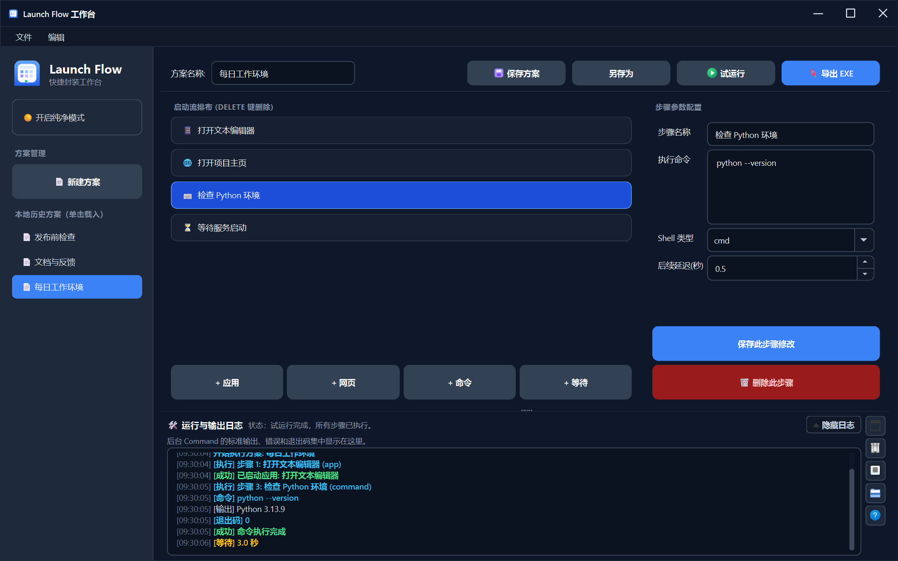
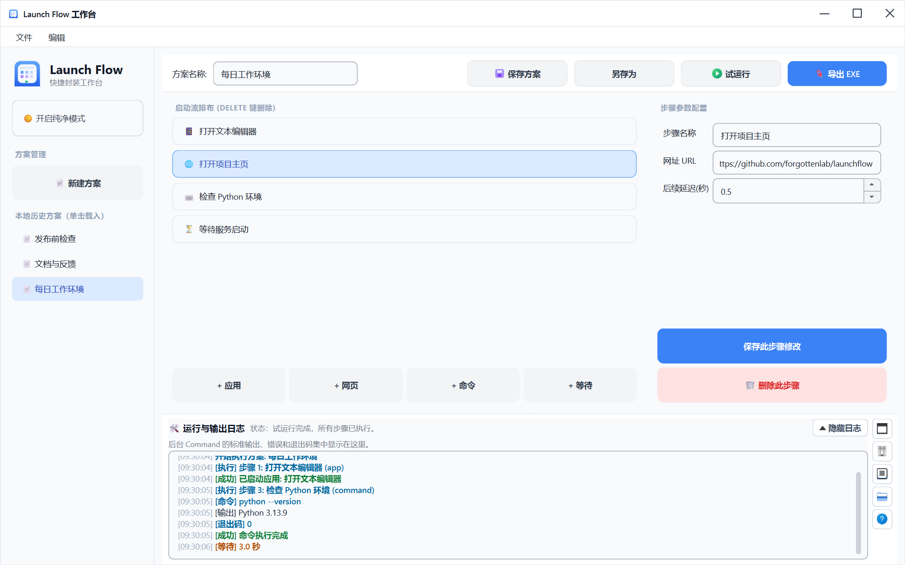
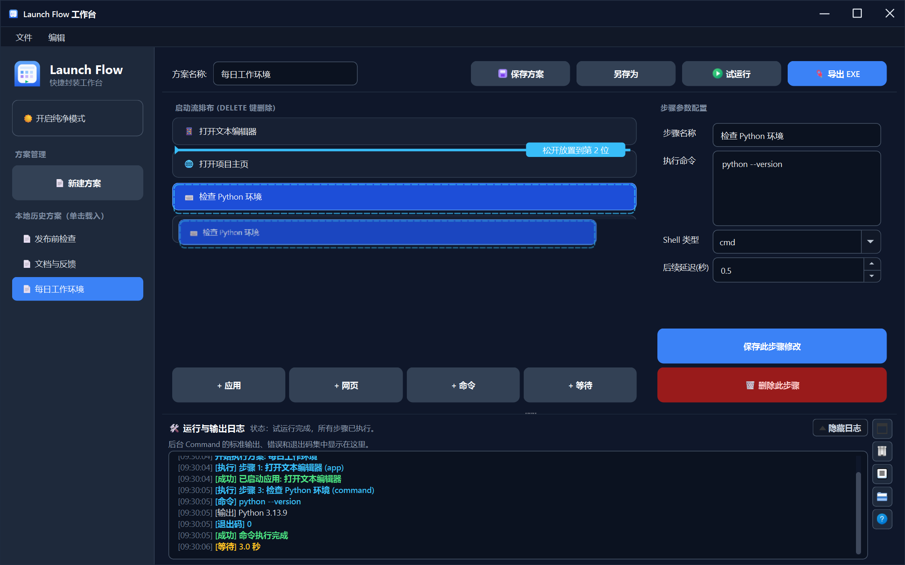
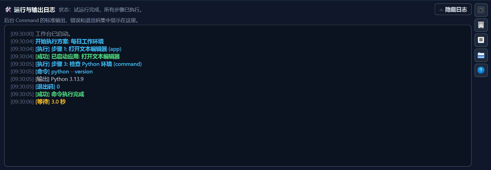
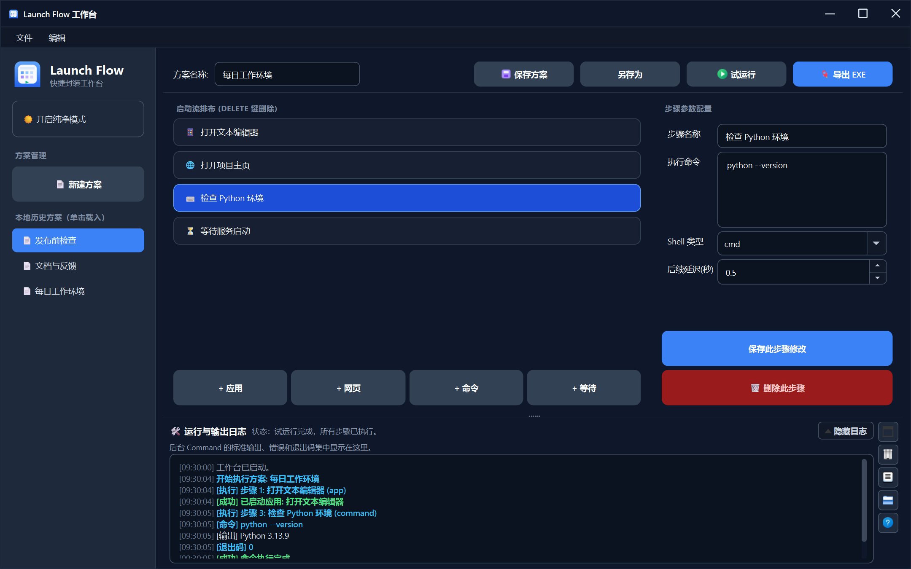
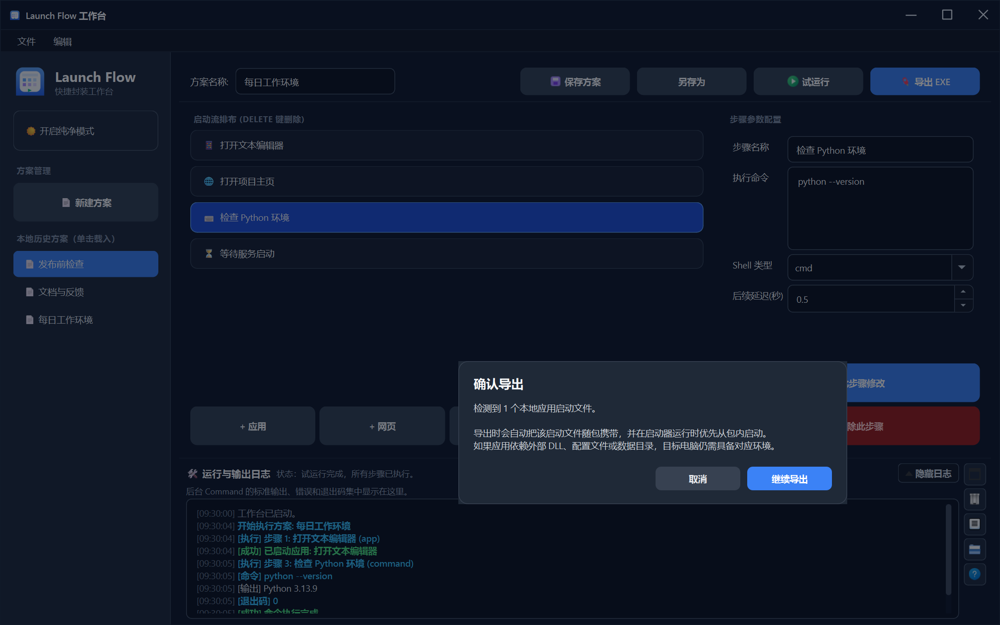

# 🚀 LaunchFlow

[简体中文](./README.md) | **[English](./README_EN.md)**

> A visual Windows workflow editor for combining applications, web pages, commands, and wait steps into reusable and exportable launch plans.

[View changelog](./CHANGELOG.md)

---

LaunchFlow turns a recurring set of startup actions into an understandable desktop workspace. You do not need to write a batch file first, and you do not need a plug-in tied to a particular programming language. Add steps in order, edit their parameters, and run the plan to prepare a work environment, a presentation setup, a classroom exercise, or a small launcher for another Windows user.

The project is currently in **Beta**. The latest completed verification checkpoint is **`v0.1.0-beta.2`**, while the application still reports the internal version **`0.1.0-beta`**. The checkpoint identifies the verified archive and release review; the internal value is the version used by the current runtime. LaunchFlow has passed physical Windows GUI checks, Release onefile validation, runtime-data isolation checks, and an exported onefile workflow, but it is not a stable release yet.



## ✨ Why LaunchFlow

Many workflows are simple but repetitive: open an editor, start a helper application, visit the project page, run one preparation command, and wait for a service to become ready. A script can perform the same sequence, but paths, shell behavior, ordering, and failures are then hidden in text. Occasional users may struggle to see what will happen or to change one action safely.

LaunchFlow represents the sequence as ordered step cards. The list explains the workflow, the property panel edits the selected step, and the log console explains what happened at runtime. Plans are stored as readable JSON. When a workflow needs to be handed to another Windows user, it can also be exported as a dedicated launcher EXE.

The product is deliberately a general workflow tool, not a frontend for Python, Java, Node, or another specific runtime. A target computer still needs the external programs and dependencies referenced by a plan. LaunchFlow coordinates them; it does not pretend to be a package manager or silently emulate missing software.

## 🌟 Core Features

- Create, edit, reorder, and remove steps in a native Windows desktop interface.
- Select a newly added step immediately and open its editable properties without an extra click.
- Save the current plan, use Save As, load a plan, and reopen recent plans.
- Test-run a complete plan before export and follow every step in the integrated log.
- Capture a Command's `command`, `returncode`, `stdout`, and `stderr` while also explaining common failures in plain language.
- Switch between dark and light themes with consistent form controls and readable focus states.
- Export a plan as a Windows single-file EXE and include eligible local application files when explicitly confirmed.
- Complete Beta activation through an offline request and signed license without an online account service.
- Keep mutable runtime data in the user's local application-data location instead of next to the EXE.

## 🧩 Four Step Types

LaunchFlow intentionally uses a small, portable step model. The current editor provides exactly these four types:

| UI label | Model type | Purpose | Main settings |
| --- | --- | --- | --- |
| Application | `application` / `app` | Launch a local program or executable | Path, arguments, post-launch delay |
| URL | `url` | Open an address with the system browser | URL, post-open delay |
| Command | `command` | Execute a general command with the selected shell | Command text, shell type, post-run delay |
| Wait | `wait` | Pause the workflow explicitly | Duration in seconds |

There are no language-specific Python, Java, or Node steps. Use the corresponding tool through a regular Command when needed. Keeping the model generic preserves plan compatibility and makes the same editor useful for development, office work, design sessions, teaching, and other Windows routines.

## 🖥️ Workbench

The workbench combines the plan header, step list, property editor, and runtime log. Selecting a card opens the settings for that step. Adding a step enters the same state immediately, so its name and parameters can be edited without selecting it a second time. The light theme uses the same information architecture and control locations.



Keyboard commands, menu entries, and toolbar buttons share the same action handlers. Saving from a shortcut therefore has the same behavior and validation as saving from the menu.

| Action | Shortcut |
| --- | --- |
| Save the current plan | `Ctrl+S` |
| Save As | `Ctrl+Shift+S` |
| Run the current plan | `Ctrl+R` |
| Export an EXE | `Ctrl+E` |
| Delete the selected step | `Delete` |

## 🔀 Reordering Steps

Drag a step card to change execution order. During the drag, the editor shows a light source-position marker, one card preview, a clear insertion line, and a message describing the destination position. Drop zones extend to the first and last positions. Reordering changes only the order of existing steps; it does not convert step types or alter the plan schema.



## 📜 Run Console and Logs

Select Run or press `Ctrl+R` to execute the plan from top to bottom. The log drawer presents startup, execution, output, wait, success, and failure events in one place. It can be collapsed, restored, and cleared. Its side tools collapse responsively when the available window height is limited, avoiding clipped half-buttons.



Command steps run in the background without opening a console window, but the original diagnostic information is retained. When Windows returns `9009`, LaunchFlow keeps the return code and stderr and also explains that the executable command could not be found and that installation or PATH should be checked. Missing target files and insufficient permission receive similarly direct explanations. The raw `command`, `returncode`, `stdout`, and `stderr` remain available rather than being replaced by the friendly message.

An Application step launches an external process and continues without waiting for that process to exit; its post-launch delay can provide startup time. URL uses the system default browser. Wait is an explicit pause within the plan. When a step fails, the log identifies the failing position so the user can return to that card and correct its settings.

## 🗂️ Plans, Recent Files, and Backups

Plans are JSON files saved at a location selected by the user. The Recent Plans menu lists plans that were opened or saved recently. Selecting an entry opens it with one click, while cleaning a stale history entry does not delete the actual plan file.



LaunchFlow stores its own settings, logs, license state, and recent-plan metadata under `%LOCALAPPDATA%\LaunchFlow` by default. Automated checks can point `LAUNCHFLOW_DATA_DIR` to an isolated location. Normal operation does not create mutable data folders beside the source tree, in the current working directory, on the desktop, or next to a packaged EXE.

Before an upgrade, back up valuable plan JSON files and any application data that must be retained. Legacy migration is intentionally conservative and copy-oriented; it should not overwrite newer data. Explicit plan-save and export destinations remain the user's choice even though background state is centralized.

## 📦 Exporting a Windows Launcher

After a successful test run, choose Export EXE or press `Ctrl+E`. The export dialog presents the destination, output name, plan summary, bundled-file review, and build state. It keeps the plan visible behind the focused dialog, allowing the user to cancel and correct the workflow before starting a build.



The result is a Windows onefile launcher created for the current plan. It contains the LaunchFlow runtime needed to read that plan and the embedded plan data, but it does not automatically bundle every third-party runtime:

- A URL still depends on the target computer's default browser and network conditions.
- A Command still depends on the selected shell, executable, PATH, files, and runtime being present on the target computer.
- An Application file is copied only when the export review confirms that it can be carried. DLLs, runtimes, configuration, drivers, registry state, and other complex dependencies are not inferred automatically.
- A successful build proves that the launcher was created; it does not prove that every external dependency exists on another machine.

Always test the plan in the editor before export. Then run the generated EXE again from a clean Windows test directory and verify that it does not leave unexpected runtime data beside itself. Review the distribution terms of every third-party application before sharing a bundled launcher.

## ⚡ Quick Start

### Using a packaged build

When public builds are made available, the [GitHub Releases](https://github.com/forgottenlab/launchflow/releases) page will list the assets and checksums for each release. LaunchFlow is still in Beta verification. If the required asset is not present on that page, use the source workflow below instead of downloading an executable from an unofficial location.

A normal packaged workflow is:

1. Place `LaunchFlow.exe` in an ordinary user-writable directory and start it.
2. If activation is requested, copy the offline request code and send it to the license administrator.
3. Import the returned `.lic` file to complete local verification.
4. Create a plan, add steps in order, and fill in their parameters.
5. Test-run the plan and resolve any remaining log errors.
6. Save the plan, and export it only when a separate launcher is needed.

### Running from source

The verified development baseline uses Python 3.13.9, PySide6 6.9.3, and PyInstaller 6.20.0. The repository does not currently contain a dependency manifest, so install the required packages explicitly in an isolated virtual environment:

```powershell
git clone https://github.com/forgottenlab/launchflow.git
cd launchflow
python -m venv .venv
.\.venv\Scripts\Activate.ps1
python -m pip install "PySide6==6.9.3" "PyInstaller==6.20.0" cryptography
python -m editor.main
```

If local PowerShell policy prevents running the activation script, call the virtual environment's Python directly instead of changing machine-wide policy:

```powershell
.\.venv\Scripts\python.exe -m pip install "PySide6==6.9.3" "PyInstaller==6.20.0" cryptography
.\.venv\Scripts\python.exe -m editor.main
```

These versions document the current verification baseline; they do not state that every other compatible version is unsupported. PyInstaller is required for the export workflow. Running the editor itself still requires PySide6 and cryptography for license verification.

## 🔐 Offline Licensing

The Beta uses a machine-bound offline license flow. The client creates a request code beginning with `LFREQ1.`. An administrator signs a `.lic` license for that request. The client verifies the RSA signature, machine binding, product, purpose, and validity period using the public key shipped as an application resource.

A request code is not a license and cannot activate the application by itself. The signing private key belongs only in the administrator environment and must not enter Git, client packages, release assets, or user-data directories. The client needs only the public key, including when frozen as a onefile application. There is no development switch that skips signature, machine, or expiry validation; development-data isolation changes the storage location, not the verification algorithm.

Do not publish complete request codes, license signatures, or other authorization material in issues, screenshots, or logs. A useful license report needs the error category, application version, and reproduction steps, with request identifiers redacted.

## 🛡️ Privacy and Network Behavior

Plan editing, saving, execution, and offline license verification are local workflows. LaunchFlow does not automatically upload plan content to a project service, and it does not invent a successful result when an external dependency is missing. A URL or a user-configured Command may access the network; that behavior belongs to the chosen address or command.

Logs can contain command text, local file paths, and output from external programs. Before reporting a problem, remove account identifiers, tokens, internal addresses, and other sensitive material. Review exported plans before sharing them as well, especially command arguments and machine-specific paths.

## 🏗️ Project Structure

```text
editor/        Desktop editor and interactive widgets
runtime/       Plan execution and structured log results
licensing/     Client requests, offline activation, and verification
shared/        Models, paths, and shared services
tools/         Build, export, smoke, and documentation validation scripts
docs/          Architecture notes, test guidance, and images
assets/        Read-only application icons and release resources
data/          Read-only defaults used in source mode
```

There is no standalone `exporter/` package. Windows launcher export is implemented by `tools/build_single_exe.py` and reuses execution logic from `runtime/`. All client licensing code lives under `licensing/`.

The plan model and release formats are compatibility boundaries. Contributions must not change the four step types, machine-code algorithm, `LFREQ1` request format, `lflic-1` schema, or RSA signature flow without an explicit migration design and matching tests.

## 🧪 Validation

The repository provides independent smoke scripts that can be run directly on Windows. A focused documentation and UI validation set is:

```powershell
python tools/check_readme_docs_smoke.py
python tools/check_editor_gui_smoke.py
python tools/check_step_reorder_smoke.py
python tools/check_log_presentation_smoke.py
python tools/check_plan_history_single_click_smoke.py
python tools/validate_release_data_isolation.py
python tools/validate_export_smoke.py
```

Run `python tools/generate_readme_screenshots.py` to reproduce the documentation images. The script instantiates the production window and widgets, uses an isolated data directory, reads or creates no license, and verifies that all six PNG files were written. Automated image generation is not a substitute for physical keyboard, pointer, scaling, and packaged-EXE checks; release review should still include real Windows desktop interaction.

## ⚠️ Current Limitations

- Windows desktop is the only verified release target.
- The product remains in Beta, so interface details and low-risk behavior may continue to change.
- Only Application, URL, Command, and Wait are supported. There are no branches, loops, remote execution steps, or language-specific step types.
- Application uses a launch-and-continue model and does not manage the external process lifecycle.
- Command captures standard streams and a return code, but it cannot replace installation and configuration diagnostics supplied by the external tool.
- The exporter cannot discover every dependency of a complex desktop application; cross-machine delivery requires manual verification.
- Licensing is currently offline and signed. There are no online accounts, automatic renewal, or cloud plan synchronization.
- The source is currently provided under an all-rights-reserved license, not an open-source license grant.

## 🗺️ Roadmap

Work after this Beta checkpoint will concentrate on reliability and clarity:

1. Extend physical Windows coverage across display scaling settings and clean user environments.
2. Improve pre-export dependency review, failure localization, and explanations for non-technical users.
3. Complete public release assets, checksum publication, upgrade notes, and repeatable build evidence.
4. Refine plan organization, history, and accessibility without changing the general-purpose four-step model.
5. Evaluate a future online-authorization design without weakening the existing signed offline boundary.

The roadmap is directional and is not a stable-release commitment. Verified release notes remain the source of truth for delivered behavior.

## 💬 Feedback and Contributions

Reproducible reports are welcome through [GitHub Issues](https://github.com/forgottenlab/launchflow/issues). Include the Windows version, LaunchFlow version, affected step type, expected behavior, actual behavior, and relevant redacted logs. For export problems, identify whether the issue occurred during the editor test run, the build phase, or execution of the generated launcher.

Before submitting a change, run the smoke checks appropriate to its scope. Changes involving shared models, licensing, security boundaries, data paths, or export behavior need broader validation. Never submit real licenses, request codes, signing keys, user plans, build artifacts, or screenshots that reveal personal paths.

## 🙏 Acknowledgements

Thanks to the **four students** who took part in the first round of LaunchFlow testing. They were willing to run an early Beta build, try real workflows and different interactions, and report what happened outside the development environment. Those firsthand accounts helped me review the product from a user's perspective instead of relying only on development-time assumptions.

Special thanks to **ZTS** and **SYZ** for their continued hands-on testing, detailed bug reports, and practical suggestions. Their feedback helped uncover and fix issues involving drag-and-drop behavior, step synchronization, log presentation, theme consistency, and the release experience. Several of these details were difficult for automated tests alone to reveal completely.

LaunchFlow is still evolving. The patience, testing, and feedback of its first testers have played an important role in helping the project move from simply working to becoming clearer and easier to use.

## 📄 License

Copyright © forgottenlab. All rights reserved.

The repository is available for inspection and collaborative evaluation, but it does not currently grant an open-source license. Unless separate written permission is provided by the rights holder, the source and build artifacts must not be treated as freely copyable, modifiable, or redistributable software. See [LICENSE](./LICENSE) for the governing terms.
