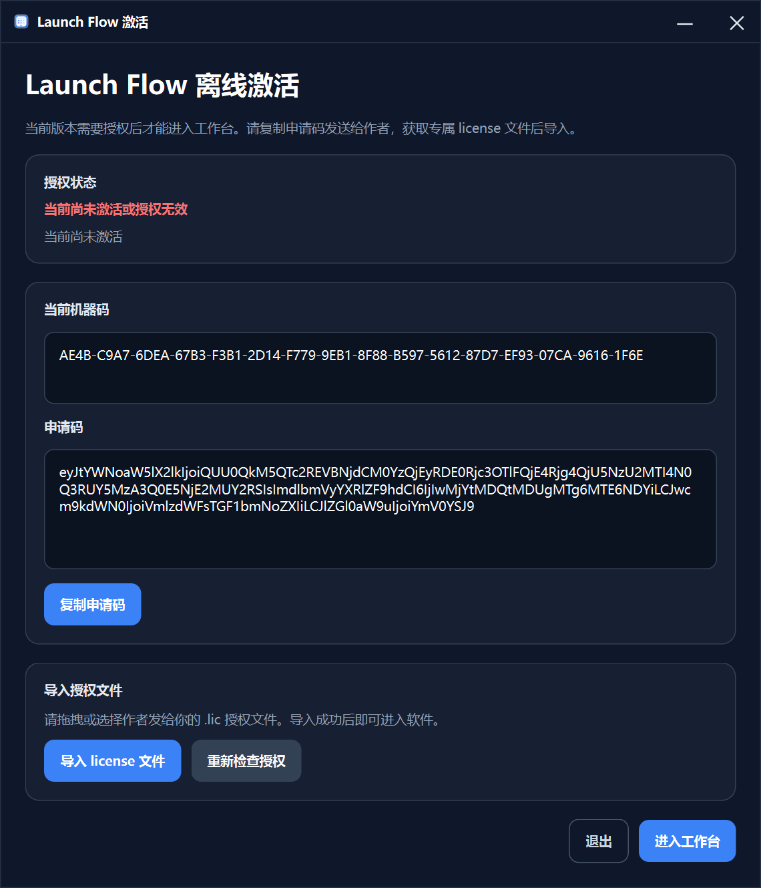

# Beta Testing Guide

本文档用于说明 LaunchFlow 当前 Beta 版本的测试方式、激活流程与常见问题。

---

## 1. 当前测试版本说明

当前测试版采用 **离线授权** 机制。

也就是说：

- 测试用户无需联网验证
- 程序本体可离线运行
- 授权文件绑定到当前机器
- 不同设备之间不能直接复用同一个授权文件

---

## 2. 测试用户使用流程

### 第一步：启动程序

双击打开测试版程序。

如果当前设备尚未激活，程序会自动进入激活页面。

---

### 第二步：复制申请码

在激活页中：

1. 查看当前机器码
2. 点击 **复制申请码**
3. 将申请码通过邮件发送给作者


> 当前授权生成流程以申请码为准，申请码中已经包含设备绑定信息。
---

### 第三步：联系作者申请授权

请将申请码发送至：

**wangheran55@gmail.com**

邮件标题建议：

```text
[LaunchFlow Beta] 申请授权
```

邮件正文建议包含：

- 你的系统版本
- 你的使用场景
- 申请码
- 你希望测试的功能点

---

### 第四步：接收授权文件

审核通过后，你将收到一个专属的授权文件，例如：

```text
TEST-0001.lic
```

---

### 第五步：导入授权文件

回到程序激活页面后：

- 点击 **导入 license 文件**
- 或直接将 `.lic` 文件拖入激活窗口

如果授权有效，状态会更新为：

```text
授权有效，可进入工作台
```


此时点击 **进入工作台** 即可开始使用。

---

## 3. 授权特性说明

当前授权机制具备以下特点：

- 授权文件与当前机器绑定
- 同一个 `.lic` 文件不可直接复制到其他机器使用
- 授权可设置版本标识与到期时间
- 程序启动时会自动校验授权有效性

---

## 4. 常见问题

### Q1：为什么我不需要单独发送机器码？

因为当前申请码中已经包含设备绑定所需的机器标识信息。  
授权生成器会直接解析申请码并提取对应机器码。

---

### Q2：为什么同一个 `.lic` 文件在另一台电脑上无法使用？

这是预期行为。  
当前测试授权采用一机一授权绑定机制，授权文件只能在签发时对应的那台设备上生效。

---

### Q3：导入授权文件后仍提示无效怎么办？

请优先检查：

1. 当前导入的是否为作者发回的正确 `.lic` 文件
2. 文件是否被修改或损坏
3. 是否在与申请授权时相同的设备上导入
4. 当前授权是否已经过期

如果仍有问题，请通过邮件联系作者并附带：

- 错误提示截图
- 当前系统版本
- 你导入的授权文件名
- 激活页截图

---

### Q4：测试版是否支持导出 EXE？

支持，但具体可用性取决于你当前使用的是：

- 开发版编辑器
- 还是发布版编辑器

默认情况下：

- 开发版支持完整导出
- 发布版通常会禁用导出环境

---

## 5. 测试反馈建议

如果你愿意帮助改进 LaunchFlow，欢迎反馈以下内容：

- UI 体验问题
- 试运行异常
- 导出异常
- 授权流程问题
- 日志显示问题
- 主题切换问题
- Windows 兼容性问题

建议反馈时附带：

- 截图
- 错误文本
- 操作步骤
- 系统版本

---

## 6. 免责声明

当前版本仍属于 Beta 测试版。

这意味着：

- 功能可能继续调整
- 部分行为可能尚未完全稳定
- 文档可能仍在迭代更新

请勿将测试版用于关键生产环境。
